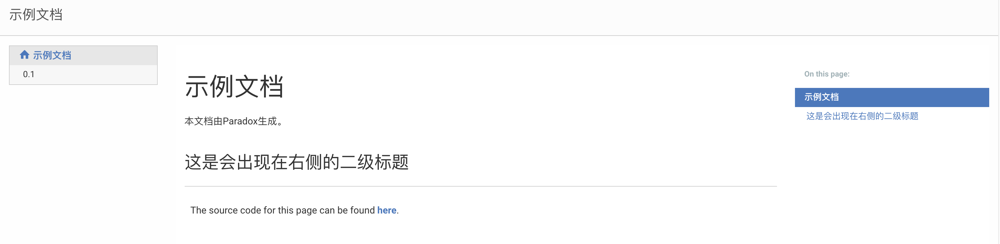

使用Paradox构建文档网站
------------

### Lightbend Paradox简介

[Lightbend Paradox](https://developer.lightbend.com/docs/paradox/current/index.html)是为了软件项目文档而开发的Markdown文档工具。它提供了开箱即用的基本样式、完善的Github Flavor Markdown语法支持，并且可以通过指定的方法进行代码片段引入。结合[sbt-site](https://www.scala-sbt.org/sbt-site/)插件，可以非常轻松地做到在本地一键发布博客的过程，或者是通过Github的Travis CI在commit之后进行自动构建发布。对于Scala程序员来说，Paradox最大的好处在于可以使得代码和文档不被割裂。你的文档可以直接放在项目里面，然后通过特定语法将代码引入到文档中，从而使得文档内容可以在IDE里面随着代码变更直接变动，而不需要上下文切换到浏览器这个新环境中进行编写。

上周我将Paradox引入了自己正在开发的项目里，并且第一次感受到了写文档的乐趣。之后便萌生想法，想要使用Paradox来构建自己的博客。当然，对于博客来说，这个组件并非最好的。但是用来做一些基本的思考记录还是足够的。Paradox最好的归宿是用来做文档网站，结合Github pages，可以轻松地做到版本相关的文档发布。目前基本上Lightbend除了基于[Playframework](https://www.playframework.com/)构建的项目是使用早就存在的PlayDocPlugin之外，其他相关的项目都是使用的Paradox来做文档管理，如[Akka](https://akka.io)，[Alpakka](https://developer.lightbend.com/docs/alpakka/current/index.html)等，尤其是一些小项目，结合Github pages，相当方便。本篇将介绍如何使用Paradox快速构建文档项目。

### Sbt配置Paradox

在`project/plugins.sbt`中添加插件：

@@snip [plugins.sbt]($project$/project/plugins.sbt) { #sbt-paradox }

在`build.sbt`中定义项目：

@@snip [build.sbt]($project$/build.sbt) { #doc-demo-sbt }

之后，你只需要在`docs/src/main/paradox`中创建index.md文档即可：

@@snip [index.md]($project$/docs/src/main/paradox/index.md) { #doc-first-demo type=text }
 

然后执行sbt命令`paradox`，就能在`docs/target/paradox/site/main`中找到`index.html`文件，以及其他css和js文件。之后直接浏览器打开`index.html`即可:



如果你拿这个页面对比一下[Alphakka](https://developer.lightbend.com/docs/alpakka/current/)的文档样式，你会发现两者几乎完全一样，只是Alphakka多了一个Akka的标志而已。

Paradox的所有源文件都是使用的[Markdown语法](https://daringfireball.net/projects/markdown/syntax)来书写。并且因为与Github结合紧密，所以其采用了[Github-flavored风格](https://help.github.com/articles/basic-writing-and-formatting-syntax/)。它背后的Markdown解析器是由[Mathias](https://github.com/sirthias)开发的[Pegdown](https://github.com/sirthias/pegdown)(这哥们儿最有名的库是后来发展成为[Akka-http](https://github.com/akka/akka-http)的[Spray](https://github.com/spray/spray))。当然，虽然这个库已经不再维护了，但是用来做这里的语法解析也是绰绰有余的。

到现在我们的文档网站已经做好了。之后便需要按照需求来组织一下页面即可。

### 页面组织

所有页面的第一个标题会成为该页面的标题，不管该标题的级别是什么。页面树是通过在Markdown文档中嵌入用`@@@ index`容器包裹的内容来解析的。格式如下：

@@snip [index.md]($project$/docs/src/main/paradox/index.md) { #doc-index type=text }

这里的页面是一个树状的结构。你可以在后面的`setup/index.md`中继续使用相同的语法进行页面扩展。但是左侧的页面树默认最多只有两级。而且，如果不做特别处理的话，在当前页面是看不到页面树的。不过你可以通过在页面中添加指令

@@snip [index.md]($project$/docs/src/main/paradox/index.md) { #depth-directive type=text }

如此之后，在当前页面就也能看到页面层次了。其中`depth`的设置可以改变页面树的级数。

以此类推，我们就能构建组织出一个文档项目的完整、清晰的结构。

### 片段引入

Github的[Markup]()有个著名的issue[#346](https://github.com/github/markup/issues/346)，其中维护者明确地拒绝了在Github Markdown中添加嵌入文件片段的请求，而不顾几百个+1的请求。这个需求说实话，确实是个刚需，所以Paradox为我们贴心地做了一下实现。通过以下语法，可以将位于`src/main/scala/HelloApp.scala`里面的包含在`// #hello-example`中间的代码片段引入本文件：
```text
@@snip [HelloApp.scala](../../scala/HelloApp.scala) { #hello-example }
```

代码源文件为：
```scala
// #hello-example
object HelloApp extends App {
  println("Hello, world!")
}
// #hello-example
```

页面中则是如下格式：

@@snip [HelloApp.scala](../../scala/HelloApp.scala) { #hello-example }

注意，不管是什么样的文件，只要文件名、路径对上，Paradox都能帮我们做引入，例如我上面的markdown文档片段就是直接从本`docDemo`项目的文档中引入进行来的。

至此，我基本把Paradox里面的主要会用到的内容讲完了。后续如果需要做更多定制化的内容，大家可以直接去看[官网文档](https://developer.lightbend.com/docs/paradox/current/index.html)，包括如何使用本博客采用的[主题](https://jonas.github.io/paradox-material-theme/)方式

接下来我们讲如何使用`sbt-site`插件

### sbt-site插件的使用

这些程序员一般都很懒，能代码做掉的事情绝对不手动去做。如果我们只使用`paradox`的话，我们需要执行sbt命令`paradox`之后，将生成在`target/paradox/site/main`里面的文件手动`git add`和`commit`到Github上面去，才能发布网站。而为了解决这个多好多步的问题，我们使用[sbt-site](https://www.scala-sbt.org/sbt-site/)插件，来让我们只需要执行`ghpagesPushSite`命令，即可一键发布。

首先还是添加插件。在`project/plugins.sbt`中添加：

@@snip [plugins.sbt]($project$/project/plugins.sbt) { #sbt-site }

其中`sbt-site`是帮助我们打包网站，`sbt-ghpages`则帮助我们发布到Github的`gh-pages`分支。

@@@ note

注意，加入`sbt-site`插件之后，之前Paradox指引的类似在`build.sbt`文件中添加到`Compile`的属性现在要添加到`Paradox`才能生效，如：

@@snip [build.sbt]($project$/build.sbt) { #paradox }

另外，为了使我们的源文件还是在`src/main/paradox`里面，你需要在项目中进行如下设定：

@@snip [build.sbt]($project$/build.sbt) { #source-setting }

否则，默认的源文件夹是`src/paradox`。

@@@

之后，我们需要在`build.sbt`文件中设置发布文档项目到的目的仓库。例如，本博客的设置为：

@@snip [build.sbt]($project$/build.sbt) { #github-setting }

注意最后一行的`ghpagesBranch := "master"`。在Github上形如`username.github.io`的仓库默认是个人主页的主项目，所以这个项目中无法设置`gh-pages`这个分支，而必须是`master`。所以这里我做了改变。但是如果是其他项目的话，则可以不加这一行。例如，假如我有一个`sbt-site`的项目，在`gh-pages`分支设置好了以后，我就可以通过`http://waynewang12.github.io/sbt-site`来访问它了。

上述设置完成以后，我们接下来需要做一次初始化设置：

```
sbt clean make-site                             # <1> Build the site
origin=$(git remote get-url origin)             # <2> Save the current remote for later
cd target/site
git init                                        # <3> Create site repo and add initial content
git add .
git commit -m "Initial import of GitHub Pages"
git push --force "$origin" master:gh-pages      # <4> Publish the repo's master branch as gh-pages
```

注意，如上所说，最后一行的`gh-pages`你需要根据你的项目性质做改变。例如，本博客的源代码就在`blog`分支，而Github pages内容则在`master`分支。所以第四步我执行的是：

```
git push --force "$origin" blog:master      # <4> Publish the repo's master branch as gh-pages
```

这一次完成了之后，每次我需要发布新内容，就只需要执行sbt命令

```sbtshell
ghpagesPushSite
```
就可以发布新内容了。


### 总结

怎么样，对于基于sbt构建项目的Scala程序员来说，是不是很简单，很方便？最棒的一点是你可以将编译通过的代码直接引入到文档里面去，之后就算代码做了变更，文档内容也会随之变更，而不会出现代码改了文档没改的尴尬情形。并且因为所有的一切都在IDE里面完成，程序员完全不需要进行场景切换，所以效率会更高，也更有动力去编写文档。

所以，十分推荐有文档需求的Scala程序员来尝试一下本插件。并且自行琢磨出一套文档和代码一起持续演进的流程，来与大家分享。


